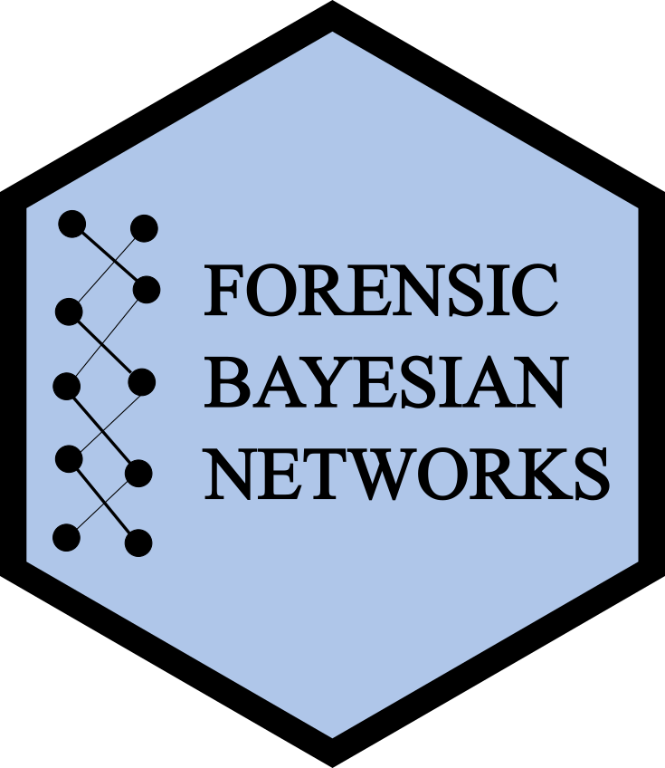

# fbnet

<!-- badges: start -->

<!-- badges: end -->

fbnet is an open source software package written in R statistical languaje. It implements the complete *GENis* functionality, a recently published open-source multi-tier information system developed to run forensic DNA databases to perform kinship analysis based on DNA profiles.
It relies on a Bayesian Networks framework and it is particularly well suited
to efficiently perform large-size queries against databases of missing individuals.
It could interact with the main functionallities of other packages for pedigree analysis. 
In particular, fbnet can interpret the pedigree formats from 'Familias' software. In addition 'pedtools', a software for creating and manipulating pedigrees and markers, is supported. fbnet allows computing LRs
and obtaining genotype probability distributions for query individual, based on 
the pedigree data.
Run an example as follows:

      > install.packages("fbnet") 
      > library(fbnet)
      > pbn  <- initBN(toyped)
      > bnet <- buildBN(pbn,QP=3)
      > bn1  <- buildCPTs(bnet)
      > resQ <- velim.bn(bn1,ordMethod="min_fill",verbose=FALSE)

After executing these lines you will obtain the conditioned genotype probability table for the query person. With reportLR() function you will be able to introduce genotypes for an unidentified person in order to calculate kinship likelihood ratio.

fbnet and GENis projects are supported by Fundación Sadosky https://www.fundacionsadosky.org.ar/ 
